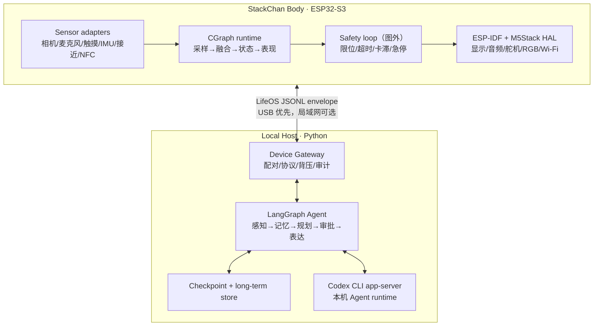

# StackChan LifeOS 架构设计

状态：Draft  
版本：0.1  
范围：本机 Agent、桌面主机服务、StackChan/ESP32-S3 固件

## 1. 目标与边界

LifeOS 把 StackChan 作为一个有持续状态的桌面实体：设备持续感知，主机上的 LangGraph Agent 负责理解、记忆和规划，设备侧 CGraph 负责采样、反射和表现的有限图编排；独立于图运行的 safety loop 负责急停、限位、看门狗和故障保护。

系统必须满足以下边界：

- ESP32 不运行 LLM，不执行任意脚本，不直接暴露文件系统或主机命令。
- Agent 只产生经过 schema 校验的意图和行为计划；不得发送 PWM、原始舵机速度或逐帧动画。
- CGraph 是设备端任务编排层，不是实时操作系统；FreeRTOS/ESP-IDF 仍负责任务、驱动、中断和看门狗。
- 所有网络能力默认关闭或仅绑定本机回环地址；设备与主机之间使用显式配对。
- 任何运动安全规则在设备端独立成立，即使主机、Agent 或链路失效也能停止运动。

## 2. 分层架构



### 2.1 数据流

1. CGraph 节点从传感器取得最新样本，丢弃过期帧并生成 `Observation`。
2. Device Gateway 校验设备身份、序列号、时间戳和 payload 大小；不把原始图像默认送入主机。
3. LangGraph 将 observation 写入短期状态，按策略触发对话、主动行为或记忆提炼。
4. LLM 节点通过 Codex Adapter 使用本机 `codex app-server`。Adapter 只暴露允许的工具和结构化输出。
5. Agent 输出 `IntentPlan`。Gateway 和设备端各自校验一次，CGraph 将可执行动作拆成有限行为节点。
6. CGraph 执行时持续接受急停、触摸和健康事件；任何安全条件优先于 Agent 计划。

## 3. 主机侧 LangGraph

### 3.1 图状态

LangGraph 的 thread-scoped checkpoint 保存一次交互的可恢复状态；long-term store 保存跨 thread 的用户偏好与经过同意的事实。`thread_id` 是恢复游标，不能用用户输入直接拼接。生产环境使用持久化 checkpointer；开发环境可使用内存实现。

建议状态字段（实现时以 Python 类型定义为准）：

| 字段 | 类型 | 约束 |
| --- | --- | --- |
| `thread_id` | UUID 字符串 | 主机生成，稳定且不可猜测 |
| `device_id` | 字符串 | 配对设备标识 |
| `recent_observations` | 有界数组 | 只保留摘要和数值，默认不留图像 |
| `conversation` | 消息数组 | 按保留策略截断/摘要 |
| `mood` | 枚举 + 强度 | 不能绕过安全状态 |
| `pending_intent` | `IntentPlan?` | 需审批的动作在此挂起 |
| `memory_candidates` | 有界数组 | 写长期记忆前需策略判断 |
| `last_error` | 错误对象 | 不包含 token、密钥或原始音视频 |

### 3.2 节点与边

```text
receive_event
  → normalize_observation
  → update_context
  → [needs_response?]
       ├─ no  → autonomy_policy → plan_reflex_or_idle → validate_intent
       └─ yes → recall_memory → codex_reason → validate_intent
  → [requires_approval?]
       ├─ yes → interrupt_for_approval → validate_resume → dispatch
       └─ no  → dispatch
  → observe_result → summarize_memory → checkpoint
```

`interrupt` 只用于需要人类确认的边界，例如发送外部消息、控制家庭设备、保存新的长期个人事实。恢复必须复用同一个 `thread_id`，并且节点在恢复时可从头重跑，因此副作用使用幂等键或 outbox。

### 3.3 Codex Adapter

第一阶段以 Codex CLI 的本机 `app-server` 为 runtime，优先使用 stdio JSONL transport；不依赖实验性的 websocket transport。Adapter 负责：

- 启动、健康检查、优雅退出和崩溃重启退避；
- 完成 `initialize`/`initialized` 握手，维护 thread/turn 生命周期；
- 将 Codex 事件转换为内部 `AgentEvent`，过滤 reasoning、路径、环境变量等不应下发内容；
- 允许列表化工具与工作目录，拒绝 `exec`、文件写入和网络访问，除非另有显式审批；
- 按当前 Codex 二进制生成并锁定 JSON Schema。Codex 官方说明 app-server schema 与所运行版本绑定，因此不得手写一套“永远兼容”的原生协议。

Codex app-server 本身是实验性接口，升级必须通过 adapter contract test；协议变化不能直接泄漏到 LangGraph 节点或设备协议。

## 4. 设备侧 CGraph 与 ESP-IDF

### 4.1 CGraph 图与兼容性

CGraph 上游是无第三方依赖的跨平台 C++ DAG/流图框架，但其官方 README/编译文档没有声明 ESP32 或 ESP-IDF 支持。因此 V1 不把“直接编译未修改 CGraph 上游”作为前提，而采用 **CGraph-shaped / selective-port** 策略：保留节点、边、静态 DAG、单 executor 等可验证概念，在 ESP-IDF 中实现最小兼容接口；只有在独立 spike 通过后，才允许替换为指定上游 tag 的子集。

设备端只使用可证明的、固定大小、有限周期任务；不把无限循环或阻塞网络调用放入图节点。上游版本（若采用）必须锁定 tag 与 commit，并记录编译器、组件和补丁清单。

```text
CaptureFrame ─┐
ReadTouch     ├→ NormalizeSensors → UpdateLifeState → ChooseBehavior
ReadIMU       ┘                                      ├→ RenderFace
ReadHealth ─────────────────────────→ SafetyGate ────┼→ MoveServo
HostCommand ────────────────────────→ SafetyGate ────┴→ EmitTelemetry
```

节点约定：

- 每次执行有明确输入、输出和超时；共享数据通过不可变 snapshot 或受保护的 mailbox 传递。
- 图只传递固定上限的结构体，不在运行时分配图像大小的内存。
- `SafetyGate` 是普通行为图中所有运动和音频输出的共同前置节点；急停、舵机故障、看门狗和电量不足拥有最高优先级。
- 急停、限位和看门狗组成独立的固定周期 safety loop，运行在图外；它不等待 CGraph、主机、网络、相机或 Agent，且可以直接停止运动。
- 采样、控制、UI、健康检查可由不同 FreeRTOS task 驱动，但每个 task 的入口保持薄，只负责调度 CGraph 图。
- V1 默认由单个 FreeRTOS executor 顺序执行静态有界 DAG，避免在 ESP32 上引入未经验证的线程池和动态调度。

### 4.2 驱动边界

```
CGraph node → LifeOS domain interface → ESP-IDF/M5Stack HAL → hardware
```

业务图不直接依赖 GPIO、PWM、摄像头 framebuffer 或 I2S。现有 M5Stack StackChan HAL、ESP-IDF 组件与驱动通过适配器注入；这样可在主机上用 fake adapter 做测试，也能避免 CGraph API 与芯片驱动绑定。

### 4.3 ESP-IDF 集成 spike 门禁

在决定引用上游 CGraph 代码前，建立独立 spike：固定 CGraph tag（当前建议评估 `v3.2.5`，不得跟随 `main`）、ESP-IDF/编译器版本和最小 DAG 示例，验证编译、静态内存、单 executor、故障停止和许可证/补丁记录。spike 失败时继续使用本地 selective-port，不把失败原因隐藏在业务代码中。

### 4.4 实时性预算

| 路径 | 目标周期/上限 | 说明 |
| --- | ---: | --- |
| 急停与安全门 | ≤50 ms | 不依赖主机或相机 |
| 舵机控制 tick | 20 Hz | 绝对位置、限速、软限位 |
| 触摸/按键反射 | ≤100 ms | 暂停、唤醒、确认 |
| UI 表现 | 5–10 Hz | 不阻塞控制 |
| 主机 observation 到意图 | p95 ≤3 s | 非实时体验链路 |

## 5. 故障隔离与降级

- Codex 不可用：LangGraph 进入 `DEGRADED_LOCAL`；设备仍运行眨眼、待机、触摸反馈和安全动作。
- LangGraph 不可用：Gateway 丢弃非紧急 agent command，设备进入本地 idle。
- 链路断开：设备停止接受旧命令，超时后回到安全姿态并释放扭矩。
- CGraph/FreeRTOS 任务异常：看门狗复位；启动时保持舵机停止，需完成自检后才允许动作。
- 相机或音频异常：标记能力不可用，不把空值解释成“没有人”；视觉功能降级不影响急停。

## 6. 部署拓扑

第一阶段只支持单主机、单设备：

```text
Host process
 ├─ LangGraph service
 ├─ Codex Adapter → local codex app-server (stdio)
 ├─ Device Gateway → USB CDC/serial
 └─ local checkpoint/store
```

多设备、局域网 transport、云端模型和 Home Assistant 集成属于后续阶段，必须先通过 `protocol.md` 的版本协商、配对和审计要求。

## 7. 参考资料

- [M5Stack StackChan 官方文档](https://docs.m5stack.com/en/StackChan)
- [LangGraph 官方概览](https://docs.langchain.com/oss/python/langgraph/overview)
- [LangGraph 持久化](https://docs.langchain.com/oss/python/langgraph/persistence)
- [LangGraph 中断与人工确认](https://docs.langchain.com/oss/python/langgraph/interrupts)
- [LangGraph 流式输出](https://docs.langchain.com/oss/python/langgraph/streaming)
- [OpenAI Codex app-server 官方源码文档](https://github.com/openai/codex/blob/main/codex-rs/app-server/README.md)
- [CGraph 官方仓库与 README](https://github.com/ChunelFeng/CGraph)
- [CGraph 官方编译说明](https://github.com/ChunelFeng/CGraph/blob/main/COMPILE.md)
